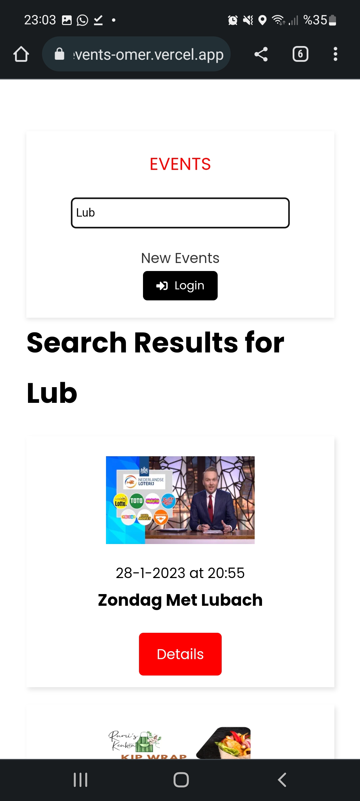

# Events-App

## General Info

A great popular fullstack Next-Strapi app which has create, update, and delete features.
####🚩🚩🚩Important 🚩🚩🚩

###### When you first visit the website, you wil most probably see a temporary ERROR.

- This will be gone if you **refresh** the page in a couple mins.
- Since I use a free deploy service, system goes back to sleep in 30 mins of inactivity.
- When you visit after that time, it will take about **two minutes** to initialize the backend.

**URL:** https://events-omer.vercel.app/

## Setup

### Repository cloning and npm packages installations

- Navigate to the desired location in your favourite terminal and type `git clone https://github.com/DegirmenciOmer/Events`
- `cd backend` and then `npm i` This will install the required packages of the strapi backend.
- When you are done with that, `cd ../frontend` and then `npm i` to install frontend packages

- create a `.env.local`file under `frontend` directory and add `NEXT_PUBLIC_API_URL=http://localhost:1337` this is the URL to get your frontend app connected to the Strapi server.

### Database connection

- Make sure you already installed postgresl in your machine.
- Create a new postgresql database.
- You can follow [this tutorial](https://www.youtube.com/watch?v=zBt0jzt-PAA) to do the database connection with Strapi.
- You will need to match the required properties in database.js with the variables in your .env in your backend.

### Run the app

- Navigate to `server` directory.
- Type `npm run dev` to run the fullstack application
- This will trigger our `concurrently` to run both backend and frontend.
- Make sure that you see Strapi is running in your CLI.
- 🎉🎉🎉 You have run the app successfully! 🎉🎉🎉

### PC:

 <br/>

### Mobile:


- As a guest user you can only visit the website and look through the Events posted by other users.

- In order to post your own events you have to sign up.

## Login & Register

 <vr/>

- When you're logged in, you have the right to post new events.
  

- You can update and delete your events in your dashboard page. You can upload image as well.
   <br/>

## Add new event

 <br/>

- When you add a new event, it will be displayed automatically on the top of the list

## Search

- You can search a specific event.
   <br/>

## Technologies

- Backend: Strapi CMS
- Database: PostgreSQL
- Frontend: NextJS

## Clone this repository

```
$ git clone https://github.com/DegirmenciOmer/Events.git
```

## To run the dev server:

```
$ cd backend/
$ npm run dev

//This will start both server and frontend.
```
